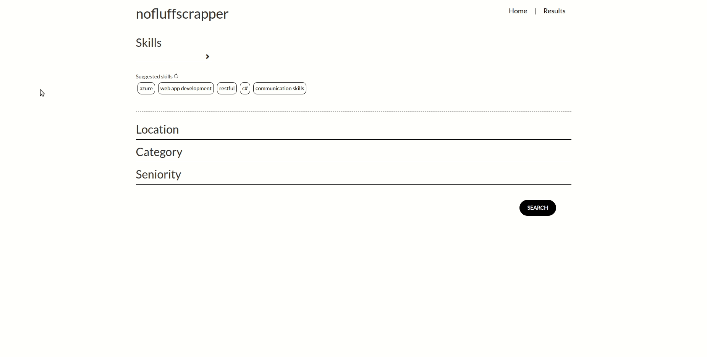

# nofluffscrapper

This selenium script visits `https://nofluffjobs.com/` and based on specified criteria looks for job offers that suit mentioned skills.

Use flask GUI to specify your configuration and add skills to your stack.
If there is a tech that is no-go, you can exclude it with leading `-` sign, eg. (`-ios`).

---

You can enable scrapper to send you reports via emails additionally - to do so, you should pass `EMAIL` and `PASSWORD` as enviromental variables.

---

The script is prepackaged in docker-compose, with `Selenium`, `Redis`, `Flask` and `Scrapper` services that will serve full experience of using the scrapper. Just run the `docker-compose up -d`.